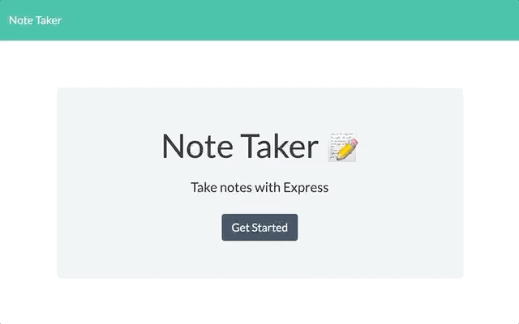

# Note Taker

Built with Express

* URL of the deployed application: https://takerofthenote.herokuapp.com

* URL of the GitHub repository: https://github.com/a-li-sa/note-taker

## Table of Contents 

* [Description](#description)
  * [Acceptance Criteria](#acceptance-criteria)
* [View](#view)
* [Usage](#usage)
* [Built With](#built-with)
* [Credits](#credits)
* [License](#license)

## Description

This application can be used to write, save, and delete notes and uses an express backend and save and retrieve note data from a JSON file. This application can be used by anyone who needs to organize and keep track of their tasks by writing, saving, viewing, and deleting their notes.

### Acceptance Criteria

- [x] Application should allow users to create and save notes.
- [x] Application should allow users to view previously saved notes.
- [x] Application should allow users to delete previously saved notes.

## View

To view the website, you can click [here](https://takerofthenote.herokuapp.com/).

## Usage

In this application, the user can write, save, view, and delete notes. The following gif demonstrates application functionality.

## Built With

* [Express](https://expressjs.com/) - A Node.js web application server framework used to build web applications. 

## Credits

Application frontend created by © 2019 Trilogy Education Services, a 2U, Inc. brand. All Rights Reserved.

## License

Copyright 2020 Alisa Poon

Licensed under the [MIT License](https://opensource.org/licenses/MIT)